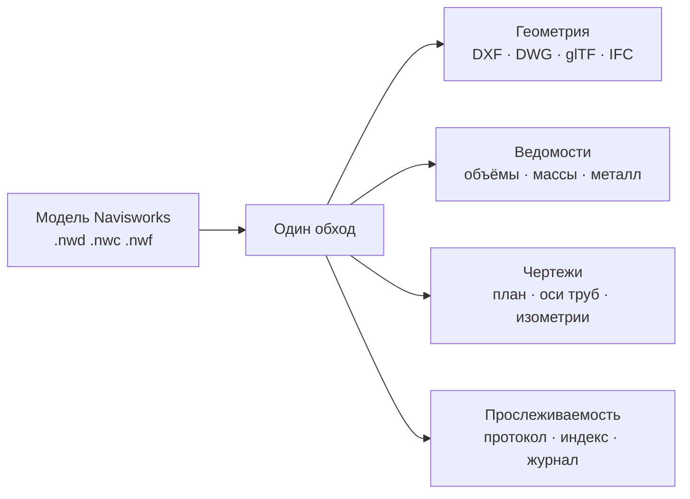

# NWD2DWG

**Выпуск рабочей документации из координационной модели Navisworks.**
Геометрия в CAD, ведомости в Excel, ответ на вопрос «что изменилось с прошлой недели».

[](LICENSE)
[](https://microsoft.com)
[](https://autodesk.com)
[]()
[]()

---

## Зачем это нужно

Navisworks показывает модель, но не отдаёт из неё то, что бюро обязано выпустить.
Геометрию в DWG для смежников, ведомость объёмов сметчику, массы для строповки,
сортамент металла конструкторам — всё это собирают руками, по нескольку часов
на комплект, каждую неделю заново.

NWD2DWG проходит модель **один раз** и попутно наполняет все включённые расчёты.
Ведомости получаются тем же проходом, что и геометрия: включение модулей почти
не удлиняет конвертацию, потому что второго обхода не требуется.



---

## Быстрый старт

**В окне.** Запустить `NWD2DWG.exe`, перетащить модель, отметить нужные галочки,
нажать «Конвертировать». Никаких ключей знать не требуется.

**Из командной строки:**

```powershell
# Подоснова смежникам: разделы отдельными файлами, чистый DXF
.\NWD2DWG.exe --convert "C:\Модели\Цех.nwd" "C:\Выдача" --split --skiphidden --purge

# Сметчику: только ведомости, без геометрии, книга Excel
.\NWD2DWG.exe --convert "C:\Модели\Цех.nwd" "C:\Выдача" ^
  --preset "Выдача: только ведомости сметчику" --boq --report-format xlsx

# Что изменилось с прошлой выдачи — Navisworks не нужен
.\NWD2DWG.exe --diff-index "выдача_01\...\_index.csv" "выдача_02\...\_index.csv"

# Папка целиком
.\NWD2DWG.exe --convert "C:\Модели\Объект" "C:\Выдача" --boq --cog
```

> [!TIP]
> Сомневаетесь в формате — оставьте DXF: он компактнее DWG и не требует AutoCAD.

---

## Что умеет

<details open>
<summary><b>Геометрия и форматы</b></summary>

| Возможность | Описание |
|---|---|
| **DXF** Polyface Mesh / 3DFACE | основной формат, пишется напрямую |
| **DWG** | через AutoCAD, формат 2018 |
| **glTF 2.0 / GLB** | для браузера, Blender, VR |
| **IFC 2x3** | OpenBIM-координация, ISO 10303-21 |
| **Упрощение сетки** | QEM-децимация 0–90% с сохранением формы |
| **Распознавание тел** | трубы, цилиндры, балки из сеток |
| **Габаритные оболочки** | передача подрядчику без раскрытия внутренней геометрии |
| **Сдвиг к нулю** | лечит «дребезг» на геодезических координатах, пишет `.wld` |

</details>

<details open>
<summary><b>Инженерные ведомости</b></summary>

| Возможность | Что на выходе |
|---|---|
| **Ведомость объёмов** | площади, объёмы, количество; группировка по элементу, слою или материалу |
| **Массы и центры тяжести** | по теореме Гаусса-Остроградского, устойчиво к большим координатам |
| **Сортамент металла** | подбор по ГОСТ 8240, 26020, 8509, 30245, 8732 |
| **Оси труб** | осевые линии с диаметрами DN и длинами |
| **Монтажные изометрии** | схемы плюс журнал трубных заготовок |
| **Гильзы и проёмы** | пересечения труб с конструкциями, задание конструкторам |
| **Высота проходов** | контроль нормативной высоты в свету |
| **2D-план этажа** | горизонтальный срез замкнутыми полилиниями |
| **Ведомость отделки** | помещения по ГОСТ 21.501 |

Ведомости выдаются в CSV **и в книге Excel**: в xlsx число хранится числом,
а обозначения марок вроде `08Х18Н10Т` остаются текстом — именно их Excel
норовит превратить в дату и испортить ведомость.

</details>

<details open>
<summary><b>Прослеживаемость выдач</b></summary>

Каждая конвертация оставляет **индекс ревизии** — список элементов с габаритами.
При следующей выдаче в ту же папку программа сама находит прошлый индекс и кладёт
рядом отчёт об изменениях и метки для наложения на модель.

| Категория | Признак |
|---|---|
| Добавлен | элемента не было |
| Удалён | был, теперь отсутствует |
| Смещён | габариты те же, центр сдвинут |
| Изменена форма | изменился габарит |
| Геометрия перестроена | габарит и центр те же, сетка иная |

**Перенос нуля площадки распознаётся отдельно.** Когда проект переносят на другой
ноль, смещается вся модель разом — это показывается одной строкой, а не тысячами
ложных «смещено». На реальном сравнении так отсеялось 4308 ложных срабатываний.

Сравниваются индексы, а не модели: проверить чужую выдачу можно на машине
**без Navisworks**.

</details>

<details>
<summary><b>Шаблоны настроек по нормам</b></summary>

| Шаблон | Норма-ориентир |
|---|---|
| Жилые и общественные здания | СП 1.13130, СП 118.13330 |
| Производственные здания и цеха | СП 56.13330 |
| Технологические трубопроводы | СП 73.13330, ГОСТ 21.605 |
| Металлоконструкции КМ / КМД | СП 16.13330, ГОСТ 23118 |
| Наружные сети и генплан | СП 42.13330 |
| Обмерные и сканированные модели | ГОСТ Р 57563 |
| Выдача: комплект по СПДС | ГОСТ Р 21.101 |
| Выдача: только ведомости сметчику | ГОСТ 21.110 |

Свои настройки сохраняются под собственным именем, выгружаются файлом и
передаются коллеге. Ключи от языковых моделей в шаблон не попадают — хранятся
отдельно и в зашифрованном виде.

</details>

<details>
<summary><b>Управление снаружи: MCP-сервер</b></summary>

`mcp/nwd2dwg_mcp.py` — сервер [MCP](https://modelcontextprotocol.io) поверх
командной строки. Зависимостей нет, нужен Python 3.8+.

```json
{
  "mcpServers": {
    "nwd2dwg": {
      "command": "python",
      "args": ["C:/rhinodwg/NWD2DWG/mcp/nwd2dwg_mcp.py"],
      "env": { "NWD2DWG_EXE": "C:/rhinodwg/NWD2DWG/dist/NWD2DWG.exe" }
    }
  }
}
```

Десять инструментов: разведка модели, диагностика окружения, шаблоны, настройки,
конвертация, сравнение выдач, журнал, чтение отчётов, состав папки, самотест.

Ключи конвертации принимаются только из закрытого списка — произвольную команду
через сервер выполнить нельзя.

</details>

---

## Выдача

```
02_Ведомости/     объёмы, массы, металл, заготовки, гильзы, отделка
03_Координация/   планы, оси труб, изометрии, метки изменений, BCF
04_Протокол/      протокол расчёта с описью, индекс ревизии
_журнал_выдач.csv одна строка на прогон: дата, модель, элементов, файлов
```

Имена собираются из шифра объекта и марки комплекта, заданных в настройках, —
выдача сразу приходит в том виде, в каком её принимает архив бюро.

> [!IMPORTANT]
> Если прогон остановлен предохранителем по объёму или месту на диске, **все**
> выданные файлы помечаются как неполные — в ведомости, протоколе и журнале.
> Тихо обрезанная ведомость опаснее отсутствующей: по ней посчитают смету.

---

## Честно о пределах

> [!WARNING]
> Программа **не заменяет Navisworks** и не проектирует за инженера.

| Ограничение | Суть |
|---|---|
| **Лицензия Navisworks** | обязательна: геометрия читается его API |
| **Запуск через автоматизацию** | нестабилен на 2026, около одной модели из дюжины требует повтора. Программа повторяет сама |
| **Плотность разбиения** | задаётся в самом Navisworks, через API недоступна. Модель на 2.5 МБ может дать 60 млн треугольников — тогда нужно упрощение сетки |
| **Координационные оси** | выгружаются только высотные отметки: геометрию линий осей публичный API не отдаёт |
| **Помещения** | восстанавливаются по срезу, объектов-помещений в модели нет |
| **Сортамент** | только базы ГОСТ, европейского нет |
| **Коллизии и 4D** | читаются из Clash Detective и TimeLiner; если связка не заведена, читать нечего |

---

## Проверка

```powershell
# Самотест расчётных модулей, Navisworks не требуется
.\NWD2DWG.exe --selftest

# Проверка окружения: Navisworks, AutoCAD, права доступа
.\NWD2DWG.exe --diagnostics

# Регрессионные проверки исходников
powershell -ExecutionPolicy Bypass -File run_tests.ps1
```

**110 регрессионных проверок** покрывают то, что ломалось на реальных моделях:
границы чанков полисетки, сварку вершин, кириллицу в CAD-файлах, точность масс
на удалении в километры, слияние написаний марок стали, приведение ведомостей
к русскому Excel, распознавание переноса нуля площадки.

---

## Сборка из исходного кода

Нужен .NET SDK и reference assemblies .NET Framework 4.7.2. Visual Studio
не требуется — сборка идёт компилятором Roslyn напрямую.

```powershell
powershell -ExecutionPolicy Bypass -File build.ps1
```

Плагин собирается только при установленном Navisworks; без него получится
`NWD2DWG.exe`, работоспособный для самотеста, диагностики и сравнения выдач.

---

## Лицензия

GNU General Public License v3.0. Исходные коды входят в поставку: их можно
изучать, изменять и распространять.

Зеркала: [GitHub](https://github.com/AnT1pal/NWD2DWG) ·
[SourceCraft](https://sourcecraft.dev/antipal/nwd2dwg)
